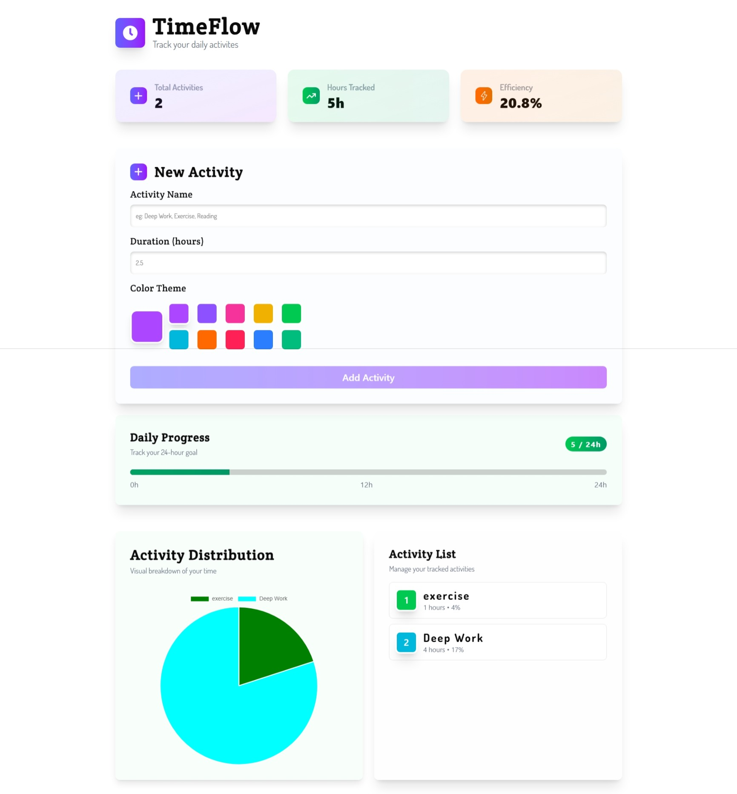

# ⏱️ TimeFlow – Time Tracker Pie Chart App

TimeFlow is a beginner-friendly React project that helps you track your daily activities and visualize your time using a clean and colorful Pie Chart. This app is perfect for mastering React fundamentals and learning how to use Chart.js for real-world data visualization.

---

## 📸 Preview
> 
>🔗 Live Demo: https://timeflowap.netlify.app/
---


## 🔍 Features

- 📝 Add, edit, and delete daily activities
- 🌈 Choose a custom color for each activity
- 📊 Visualize time spent with a responsive Pie Chart
- 🧮 See total hours tracked (with warning if over 24)
- 💾 Save your data locally using `localStorage`
- 💡 Intuitive UI powered by Tailwind CSS and ShadCN components

---

## 🧠 Concepts & Skills Demonstrated

- Functional React with Vite and TypeScript
- Managing state and controlled forms
- Dynamic Chart.js integration
- Custom component design with ShadCN UI
- Local storage persistence
- Clean, modular code with real-world app structure

---

## 🧠 Tech Stack Covered:

- ⚛️ React + Vite (with TypeScript)
- 🎨 Tailwind CSS
- 🧩 ShadCN UI Components
- 📊 Chart.js (Pie Chart visualization)
- 💾 `localStorage` (for data persistence)

---


## 🚀 How to Run

```bash
npm install
npm run dev
```

## 💡 What I Learned
- Building a project using Vite + TypeScript + Tailwind from scratch
- Making interactive charts using Chart.js
- Implementing localStorage to persist app data
- Designing clean UI with reusable components and Tailwind utilities
- Handling forms and conditional rendering in React
- Planning user experience with helpful fallback messages (like "No data yet")


## 🙌 Let's Connect

If you liked this project or have feedback, feel free to connect with me:

- 💼 [LinkedIn](https://www.linkedin.com/in/aravinth-dev/)

---

## © 2025 | Built with focus, logic, and continuous learning.
